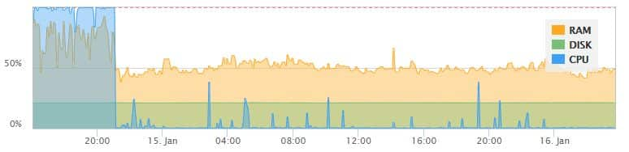

A while ago, Love Sudo decided to start our own hosting platform (a topic we'll go into in the future). After a lot of looking around, we fell in love (as you should be with any service you use) with a recent SAAS (software-as-a-service) platform from [Delicious Brains](https://deliciousbrains.com/) (the excellent team behind the fantastic WP DB Migrate Pro) called SpinupWP.

_We'll have a blog covering that decision making process soon, but if you're interested in getting a $50 credit 30 days after signing up to try them use [this referral link](https://spinupwp.com/?referral=13oLjol5XV)._

As anyone who hosts or handles the maintenance of a website knows, monitoring is key. Internally we use StatusCake and I cannot recommend them enough. Recently however, we started getting notifications about one of our servers running consistently at almost 100% CPU and 100% RAM.

This confused us, as when we logged into the box to check it we never saw that peak. This lead us into a journey to discover what caused the high reporting and the solution.

## The Search...

We wanted to make sure that the script being run for our monitoring was reporting accurate information. Working with the incredible folks over at StatusCake, we were able to check the script and tested it against our own script, but again, the load was reporting exceedingly high.

We turned to one of the most powerful, life-saving tools found in the arsenal of operations: sysstat. Using sysstat we sat and watched the server's resources live and noticed an interesting trend. Every minute on the dot, we saw RAM and CPU resources rise to critical levels for ~8 seconds.

In our experience, anytime we see a trend like that consistent, we know the number one place to look is at the cronjobs running on the server.

## The Brilliance of Good Developers

As the server we're having the issues on is one that we had provisioned and set up through SpinupWP, we started digging into the cronjobs. What we discovered made our entire operations team dance in joy, while simultaneously shake our heads.

You see, the devs over at Delicious Brains know how to make a solid WordPress hosting platform. Performance is one of the key features of their solution and one source of that performance? The turning off of wp-cron.php and the setting up of a proper cronjob to perform the functions instead.

It's honestly beautiful how they set it up, and how they clean up after themselves if you remove a website from your SpinupWP Dashboard. It almost brings a tear to the eye!

Mixed in those beautiful cronjobs was also the cronjob for our server monitor that we set up through StatusCake. Again, elegantly done and configured.

The result? Two companies that do not know each other (though hopefully they will after this) who do things right presented a perfect storm where when wp cron was being run, the monitor was doing a check as well. Therefore every time the server monitor tested the resources, it was testing it during the time when wp cron was running. Anyone who has ever done any work with WordPress knows the pain that wp cron can bring to a server's resources.

## The Solution

To fix this issue, we modified the cronjobs set up by SpinupWP to run at different times than the server monitor. This way if the server monitor reports an issue, it's because that newly created 3 second window when wp cron runs has really had an issue or there is something else wrong. The result is that beautiful graph you see above. Look at it? That change was major!

We want to give a massive thank you to StatusCake and DeliciousBrains as they have been exceptional in our discovery process as we investigated and dealt with the issue. 11/10 would recommend both to anyone!
